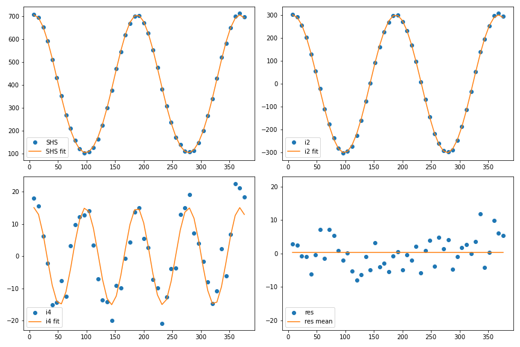

.. _analysis_SHS_page:

SHS analysis
=============

Once the spectrum analysis for all the angles has been performed, see ref:`polarisation_procedure_page`, several observables can be extracted from the angle-dependent intensity data. Many possible analyses can be made depending on what you are looking for. We are detailling the two that are commonly used at your lab, ILM.

.. image:: _static/alpaga_18.jpg
   :width: 200
   :align: right

But, if you have developed your own code that extracts other observable from the intensity in function of the polarization angle data, please do not hesitate to contact us so that this code can be added in Alpaga! 

--------------------
Theoritical stuff
--------------------

a, b ,c formalism
^^^^^^^^^^^^^^^^^

.. _SHS_analysis:

One can show that the expression of the Second Harmonic Scattering (SHS) intensity resolved in polarization is:

.. math::
    
    I^{\Gamma}_{SHS}(\gamma) = a^{\Gamma}cos^4(\gamma) + b^{\Gamma} cos^2(\gamma)sin^2(\gamma) + c^{\Gamma}sin^4(\gamma)
    
    
with a, b ,c coefficients depending of hyperpolarizabylity (ref papier), :math:`\gamma` the polarization's state of the incomming light and :math:`\Gamma` the  polarization's state of the scattered light ( Vertical or Horizontal ).

From this formula and the a, b ,c parameters, we can calculate three experimental observables, see :cite:p:`cyvin1965theory` or :cite:p:`brasselet1998multipolar` :

- D : The depolarization ratio 

.. math::

    D = \frac{c^V}{a^V}

- ZetaV / ZetaH

.. math::

    \zeta^V = \frac{b^V - a^V - c^V}{b^V} ~~~~~~~~~~~~~~~~~~~~~~~~ \zeta^H = \frac{a^H - c^H}{a^H + c^H}\\
    

(GLB : ref papier/ thèse, nos theses ?  )

To compute uncertainties for Zeta and D, we first propagate the uncertainties from the Gaussian fit : for that we use « weight » in the Ishs fit procedure (fonction python). From this fitting procedure, standard deviations on a, b ,c  are obtained as the diagonal of the covariance matrix (GLB :ref : Leo, W. R. (1994). Techniques for Nuclear and Particle Physics Experiments. A How-to
Approach. Springer Berlin, Heidelberg.):

.. math::

    \begin{pmatrix}
    \sigma_a^2 & cov(a,b)  & cov(a,c) \\
    .         & \sigma_b^2 & cov(b,c) \\
    .         & .          & \sigma_c^2
    \end{pmatrix}\\\\

Then we calculate uncertainties on the observables using gaussian error propagation formula (GLB : ref :Page 60 THESE RF):

|

.. math::

        \sigma^2(f) &=~  \left(\frac{\partial f}{\partial a}\right)^2 \sigma_a^2 + \left(\frac{\partial f}{\partial b}\right)^2 \sigma_b^2 + \left(\frac{\partial f}{\partial c}\right)^2 \sigma_c^2 \\ \\ \\

  
Finally, the uncertainties on D, zetaV and zetaH are calculated in Alpaga as follow:

.. math::
    
    \sigma^2(D) &=~  \frac{c^2}{a^4} \sigma_a^2  +\frac{1}{a^2} \sigma_c^2 \\ \\
    \sigma^2(\zeta^V) &=~  \frac{1}{b^2} \left( \sigma_a^2 + \sigma_c^2 \right) +
    \left(\frac{a + c}{ b^2}\right)^2 \sigma_b^2 \\ \\
    \sigma^2(\zeta^H) &=~  \frac{4}{(a+c)^2} 
    
|

i0, i2, i4 formalism
^^^^^^^^^^^^^^^^^^^^

Polarized-SHS resolved experiments can also be analyzed with Fourier series developments:

.. math::
    
    I^{\Gamma}_{SHS}(\gamma) = i_0^{\Gamma} + i_2^{\Gamma} cos(2\gamma) + i_4^{\Gamma}cos(4\gamma)
    
Then coefficients can be estimated as Fourrier series:

.. math::
    
    \tilde{i}_0 &= \frac{1}{N}  \, \sum_{n = 0}^{N -1} \, I_n \simeq  i_0^{} \\
    \tilde{i}_2 &= \frac{2}{N}  \, \sum_{n = 0}^{N -1} \, I_n \, cos(2\gamma_n)  \simeq  i_2^{} \\
    \tilde{i}_4 &= \frac{2}{N}  \, \sum_{n = 0}^{N -1} \, I_n \, cos(4\gamma_n) \simeq  i_4^{}
        
where N is the number of measurements.       

We can then obtain all the contributions from the signal:

   
All graphs are plotted as a function of the incoming polarization angle.  

- TOP LEFT: raw data of :math:`I_{SHS}` for V-outlet Polarisation, and fit :math:`i_0 + i_2 ~cos(2\gamma) + i_4~cos(4\gamma)` in continuous curve. 

- TOP RIGHT : :math:`I_{SHS}^V - i_0 - i_4 ~cos(4 \gamma)`  in dots, and fit :math:`i_2 ~cos(2 \gamma)` in continuous curve.

- BOTTOM LEFT  : :math:`I_{SHS}^V - i_0 - i_2 ~cos(2 \gamma)` in dots, and fit :math:`i_4 ~cos(4 \gamma)` in continuous curve.

- BOTTOM RIGHT : Residues :  :math:`I_{SHS}^V - i_0 - i_2 ~cos(2\gamma)-i_4 ~cos(4 \gamma))` in dots, and his mean value in continous curve.  

Here is the python code:
::
    
    fig, axes = plt.subplots(nrows=2, ncols=2, figsize=(12, 8))
    axes[0][0].plot(L_x,L_y, 'o' , label='SHS' )
    axes[0][0].plot(L_x, (i0 + i2*np.cos(2*np.pi/180*(L_x-alpha_0)) + i4*np.cos(4*np.pi/180*(L_x-alpha_0)) ), '-', label='SHS fit' )
    axes[0][0].legend(loc='best')

    axes[0][1].plot(L_x, L_y - (i0+i4*np.cos(4*np.pi/180*(L_x-alpha_0))),  'o',  label='i2')
    axes[0][1].plot(L_x, i2*np.cos(2*np.pi/180*(L_x-alpha_0)),  '-',  label='i2 fit')
    axes[0][1].legend(loc='best')
    
    axes[1][0].plot(L_x,L_y - (i0 + i2*np.cos(2*np.pi/180*(L_x-alpha_0)) ),  'o', label='i4')
    axes[1][0].plot(L_x, i4*np.cos(4*np.pi/180*(L_x-alpha_0)),  '-',  label='i4 fit')
    axes[1][0].legend(loc='best')

    axes[1][1].plot(L_x,L_y - (i0 + i2*np.cos(2*np.pi/180*(L_x-alpha_0)) + i4*np.cos(4*np.pi/180*(L_x-alpha_0)) ), 'o', label='res'  )
    axes[1][1].plot(L_x,L_res_mean,  label='res mean' )
    axes[1][1].legend(loc='lower left')
    axes[1][1].set_ylim([-23, 23])
    fig.tight_layout()
    

In order to compute the uncertainties on our observables, we use the residue from the analysis to calculate the standard deviation as:

.. math::

    \sigma_{\tilde{i_0}} = \frac{\sigma_{res}}{\sqrt{N}} ~~;~~ \sigma_{\tilde{i_2}} = \frac{\sigma_{res}}{\sqrt{2N}} ~~;~~ \sigma_{\tilde{i_4}} = \frac{\sigma_{res}}{\sqrt{2N}} 

--------------------
Numerical Stuff
--------------------

All of these calculations are numericaly implemented in shs_module.analyse_polarization_SHS in V and H version:  

.. autofunction:: shs_module.analyse_polarization_SHS_V
   :noindex:

|
   
.. autofunction:: shs_module.analyse_polarization_SHS_H
   :noindex:

:cite:p:`rondepierre2025correlations`.

:Release: |release|
:Date: |today|

