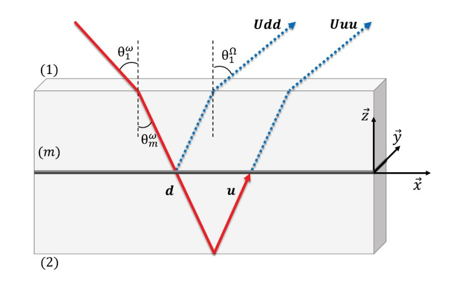

.. _analysis_SSHG_page:

SSHG analysis
=============

Once the spectrum analysis for all the angles has been performed, see ref:`polarisation_procedure_page`, several observables can be extracted from the angle-dependent intensity data. Many possible analyses can be made depending on what you are looking for. We are detailing here the analysis commonly used at ILM. 

See *tutorial_SSHG* for examples. 

But, if you have developed your own code that extracts some observable from the intensity in function of the polarisation angle, please do not hesitate to contact us so that this code can be added in Alpaga! 

The *sshg_module* of Alpaga is designed to extract susceptibility tensor coefficient :math:`\chi` from polarisation resolved SSHG experiments on a isotropic and achirale interface. For that, we extract these coefficients by fitting our experimental data with the theoretical equations ( !!!REF!!!) :

.. math::
    
    I_{P}(\gamma) &\propto \lvert (a_2 \chi_{xxz} + a_3 \chi_{zxx} +a_4 \chi_{zzz}) cos^2(\gamma)+a_5 \chi_{zxx} sin^2(\gamma)  \rvert ^2 \\
    I_{S}(\gamma) &\propto \lvert a_1 \chi_{xxz} sin(2\gamma)  \rvert ^2

Where :math:`\gamma` is the incoming polarization angle and {S, P} are the output polarization angles. 

--------------------------
:math:`a_i` coefficients
--------------------------
.. _ai_coeff_section:

In order to extract the :math:`\chi` coefficients, we first need a value of the ai coefficients. They are calculated from the three layer models :cite:p:`brevet1997surface`, where an 'interfacial' layer produces the S-SHG signal. These ai coefficients contains the Fresnel transmission and reflexion coefficients at the different interfaces. In order to calculate them, we only need refractive indexes of the two bulk media at fundamental and harmonic frequencies, and the angle of incidence between the laser beam and the interface interface.

.. autofunction:: sshg_module.ai_coeff
   :noindex:

--------------------------------------------
Theoretical equation for SSHG intensities
--------------------------------------------
.. _chi_coeff_section:

Once the ai coefficients are calculated, one can calculate the intensity curves from some \chi coefficients..

.. autofunction:: sshg_module.fit_polaS
   :noindex:
   
And :

.. autofunction:: sshg_module.fit_polaP
   :noindex:

It also exists *sshg_module.fit_pola45* function if you want to analyse some experiments with the outlet polarization angle fixed at 45°.
These two functions are not the ones that make the fitting.  They just describe how the theoritical equation evolve with the :math:`\gamma` angle.

--------------------------------------------
Fitting procedure to obtain Chi coefficients
--------------------------------------------
  
The previous functions for :math:`a_i` and theoretical intensities are combined in a single function which allow to extract :math:`\chi` coefficients from experimental data.
This function uses the datas and experimental parameters (such as medium refractive indexes and incidence angle of the fundamental beam) and, by fitting, returns the chi coefficients and ai.

It's also important to note that with these equation there is two possible sets of coefficient that differs only for chi coefficient signs which are equivalent. We can distinguish the physical set by looking at the 45° polarisation.

.. autofunction:: sshg_module.analyse_polarization_SSHG
   :noindex:

A tuto is written to show how to use the module, how to plot the fit results and see the influence of the choice of the set of :math:`\chi` coefficients over the 45° polarisation.

:Release: |release|
:Date: |today|
