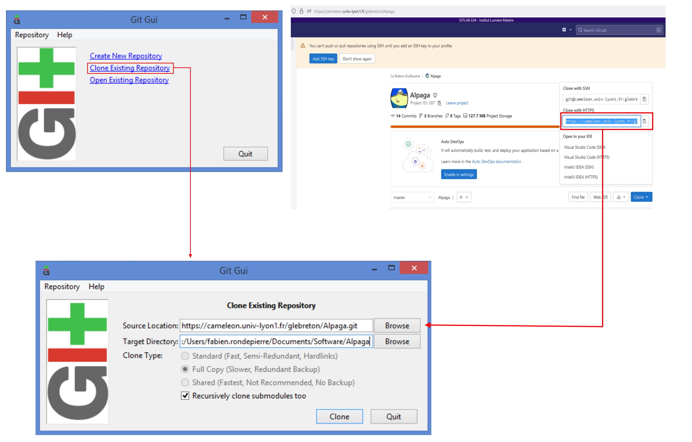
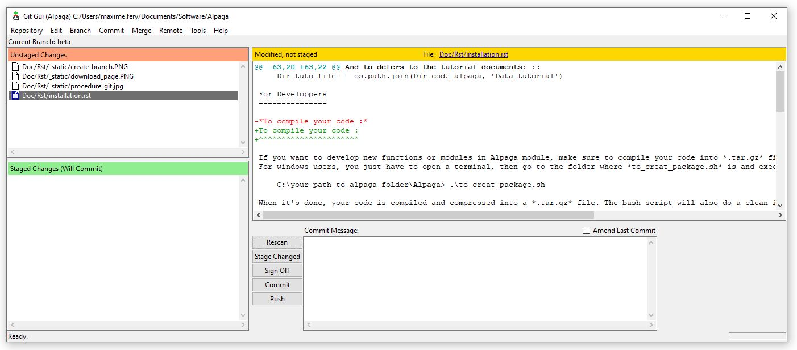

.. _installation_page:

Installation
============

.. image:: _static/alpaga_22.jpg
   :width: 200
   :align: right
   

Installation using pip
-----------------------
Alpaga is a python module which can be installed using pip once the *Alpaga-version.tar.gz* file download. Use: ::

    pip install Alpaga-1.0.0.tar.gz

Installation using conda
------------------------

To install using graphical Anaconda, open the Anaconda shell and run the above pip line. Make sure to call the right *Alpaga-1.0.0.tar.gz* file -- *i.e* with the correct file location in your computer.

.. image:: _static/anaconda_install_alpaga_visualization.png
   :width: 500
   :align: center

Check the installation
----------------------
To use Alpaga. You can call Alpaga within a python environment using the classical import function: ::
    
    import Alpaga
    import Alpaga.alpaga as alpaga
    
Make sure to be out of the directory where the source code is located to ensure that it is indeed the package that is called. 

.. note:: You can use `print(alpaga)` to see where python import the package.

The *alpaga* module is the one where the core functions are contained. Other files are available in this package, contained in the directory *Data_tutorial*. The directory where is contained these files is accessible using: ::
    
    import os
    import Alpaga
    import Alpaga.Data_tutorial
    Dir_tuto_file = os.path.dirname(Alpaga.Data_tutorial.__file__)
    print(Dir_tuto_file)

You can use these data to try the tutorial. You have one containing only one acquisition, *Single_acquisition*, and the other with a typical polarisation acquisition, *Eau_polar_V*. See the tutorial file for example. 

Custom Installation
-------------------

If you do not want to use pip, you can unzip the *Alpaga-version.tar.gz* file. In this file, find where the *alpaga.py* is located. You have to update your python path so that it contains the directory where is located the *alpaga.py* file: ::
    
    import sys
    Dir_code_alpaga = '/where/is/located/the/alapaga.py/file'
    sys.path.append(Dir_code_alpaga)
    
And to defers to the tutorial documents: ::
    
    import os
    Dir_tuto_file =  os.path.join(Dir_code_alpaga, 'Data_tutorial')
    
For Developpers
---------------

To compile your code :
^^^^^^^^^^^^^^^^^^^^^^

If you want to develop new functions or modules in Alpaga module, make sure to compile your code into *.tar.gz* file. To do so, one can use the bash script *to_creat_package.sh*.
For windows users, you just have to open a terminal, then go to the folder where *to_creat_package.sh* is and execute it like that : ::

    C:\your_path_to_alpaga_folder\Alpaga> .\to_creat_package.sh

When it's done, your code is compiled and compressed into a *.tar.gz* file. The bash script will also do a clean install of the new Alpaga module.

To compile the wiki :
^^^^^^^^^^^^^^^^^^^^^

After changing *.rst* file to add the information you want in the wiki, make sure to compile your changes to make it appears in HTML files. To do so, there are some python packages to add before compilation : Sphinx - Sphinxcontrib-bibtex - Recommonmark.

For windows users, you can use : ::

    python -m pip install sphinx
    python -m pip install sphinxcontrib-bibtex
    python -m pip install recommonmark
   
You can then compile your wiki with : ::

    C:\your_path_to_alpaga_folder\Alpaga\Doc\Rst> python -m sphinx -b html . ../Html/.

Your changes should now appear in HTML files.

Using of git :
^^^^^^^^^^^^^^

This code is developed using git because of these multiple contributors. In this section, we will see how we can use git to implement new functions, fix some bugs or edit wiki.

**Installation :**

First of all, we need git on our computer. Most of us are used to use Graphical User Interface (GUI) of git SCM so we are presenting this tool, but feel free to use other software if you're used to. You can have it here :

.. image:: _static/download_page.PNG
   :width: 500
   :align: center

Choose your version of the soft and install it. Once it's done, you can open git GUI. The first step is to link Alpaga gitlab with a new work repertory. To do so, click *clone existing repertory* and then copy the clone as shown in the picture, then choose a directory where to put your working version of Alpaga.

   
Now we have to import the working branch (usualy Beta branch) into the directory. To do so, click branch / create / then choose option like in the following :

.. image:: _static/create_branch.PNG
   :width: 500
   :align: center
   
|

Well done, you can now contribute to this project !

|

.. image:: _static/alpaga_25.jpg
   :width: 200
   :align: center  
   
|
|

**How to work together : Pull, Push, Fetch, Flush and other lovely stuff**

We recommand to always be sure to have the latest version of the code before doing some modification. This procedure is called Pull and is separated in two : 

- First called **fetch** where you download the latest version of the code from gitlab. This 'download' is not directly visible on your computer. To do so : [ Remote **->** Fetch from **->** origin ].

.. image:: _static/fetch.JPG
   :width: 700
   :align: center 

- Second called **merge**. It will **merge** the version of Alpaga from gitlab with the version that you have modified. It should conserve your change and implement changes from gitlab. To do so : [ Merge **->** Local merge ]. For exemple, if you want to merge the tracking branch Beta with your own Beta branch, select [ Tracking branch **->** origin/beta ] .
   
.. image:: _static/merge.JPG
   :width: 700
   :align: center 
   
   
.. note:: You may have some merging issue if you work on a file which is not the latest version. There will be a conflict between your version of the file and the one in gitlab. If you can't solve this conflict, as a last resort, you should try to save the file in an other folder, redownload the file from gitlab, and then implement your change by hand. We called this process the **Flush**.

When you have finished your job, in order to add your contribution to the Gitlab, you have to **Pull**.

- First of all, you will scan our change from gitlab with [ Rescan ]. You should now see all your changes in the GUI.

- Then you have to valid those changes with [ Stage changed ].

- You will commit those changes with [ Commit ]. Don't forget to put a little message describing what is the purpose of this commit.

- Finaly, you can push your commits on gitlab. After that, everyone pulling Alpaga will have your contrubtion !

